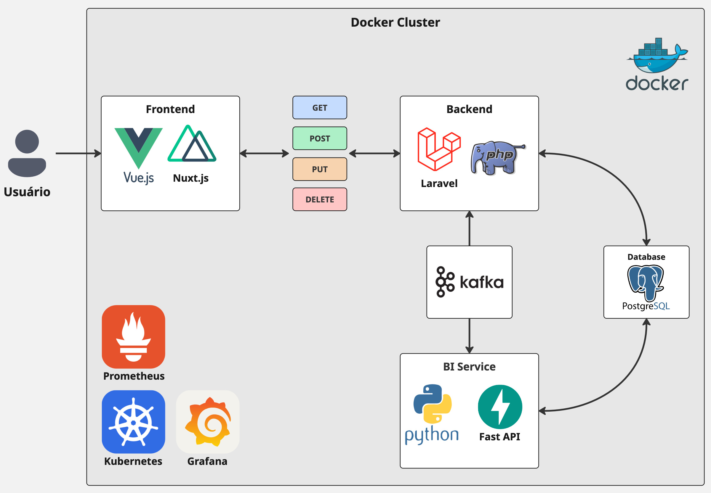

# 📘 Technical Design Document - D.R.S

**Versão:** 1.1.0 | **Status:** Ativo | **Última Atualização:** 23/02/2026
| **Público-Alvo:** Equipe de Engenharia e Desenvolvimento

## 1. Visão Executiva

O **D.R.S** (Data Resource System) é uma plataforma SaaS verticalizada voltada ao varejo de comunicação visual. O objetivo deste documento é estabelecer as diretrizes arquiteturais, stack tecnológica e padrões de projeto que guiarão o desenvolvimento interno, garantindo alinhamento técnico, escalabilidade e manutenibilidade do código.

### 1.1 Objetivos de Engenharia

- **Desacoplamento:** Separação estrita entre camadas de apresentação (Front), regras de negócio (Back) e processamento analítico (Data).

- **Escalabilidade:** Arquitetura Cloud-Native baseada em containers e orquestração.

- **Consistência:** Adoção de tipagem rigorosa e padrões arquiteturais sólidos em toda a base de código.


## 2. Arquitetura Geral do Sistema

O sistema adota um modelo de **Arquitetura Orientada a Eventos (Event-Driven Architecture)**, segregando responsabilidades em serviços específicos.

- **Frontend (Apresentação):** Single Page Application (SPA) que atua unicamente como interface de utilizador, consumindo dados via chamadas HTTP síncronas.

- **Backend Core (Transacional):** Monolito que detém o domínio de negócio, validações transacionais, regras fiscais e controlo de estado do sistema. Expõe uma API RESTful.

- **Data Service (Analítico/Inteligência):** Microsserviço isolado, responsável pelo processamento assíncrono de dados massivos, inferência de modelos de Machine Learning e execução de Agentes (RAG).

- **Camada de Integração:** A comunicação síncrona ocorre via APIs REST. A comunicação assíncrona (ex: desacoplamento de rotinas pesadas entre o Core e o Data Service) ocorre através de um Message Broker.

### 2.1 Diagrama de Arquitetura de Alto Nível




## 3. Modelação de Dados e Isolamento Lógico (Multi-Filial)

Como o sistema é operado por uma matriz com múltiplas filiais, adotamos o padrão de **Hierarchical Data Isolation (Isolamento Multi-Filial)**, e NÃO um Multi-Tenancy estrito.

### 3.1. Estrutura de Base de Dados

Todas as tabelas transacionais e operacionais (Vendas, Estoque, Funcionários) devem possuir as colunas:

- `id` (UUID ou BigInt).

- `branch_id` (Chave Estrangeira para a tabela `branches` - Filiais).

- `created_at` / `updated_at`.

- `deleted_at` (Soft Delete obrigatório).

### 3.2. Estratégia de Isolamento

O isolamento será feito via **Contextual Scopes** aliado ao RBAC (`spatie/laravel-permission`):

- **Utilizadores Locais (Vendedores, Gerentes de Loja):** Ao realizar uma consulta, o sistema valida se o utilizador possui a permissão `view-all-branches`. Caso não possua, o Backend automaticamente acopla o filtro `->where('branch_id', auth()->user()->current_branch_id)` na _Query_.

- **Utilizadores Globais (Diretoria, Backoffice):** Possuem a permissão `view-all-branches`. O sistema ignora o filtro de `branch_id`, permitindo agregações e visões gerais de lucro/vendas.

- **Header de Contexto:** O Frontend deve enviar o Header HTTP `X-Branch-Id` em todas as requisições para informar em qual filial o utilizador está a operar naquele momento (útil para funcionários que cobrem turnos em lojas diferentes).


## 4. Stack Tecnológica

### 4.1 Frontend

- **Nuxt 3 (Vue 3 + TypeScript):** Framework base para a SPA, provendo roteamento e estruturação.

- **PrimeVue (Unstyled) + Tailwind CSS:** Sistema de componentes de UI complexos (DataTables, Trees) com estilização delegada ao Tailwind.

- **Pinia:** Gestão de estado global.

- **Ofech:** Cliente HTTP padrão.

### 4.2 Backend Core

- **Laravel 11 (PHP 8.3):** Framework base para a API REST transacional.

- **Sanctum:** Autenticação Stateless via Tokens.

- **Scramble:** Geração automatizada de documentação OpenAPI (Swagger).

- **Ecossistema Spatie:**

    - `laravel-query-builder`: Padronização de filtros e ordenações de API.

    - `laravel-data`: Transferência de dados fortemente tipada (DTOs).

    - `laravel-permission`: Controlo de Acesso Baseado em Papéis (RBAC).

    - `laravel-activitylog`: Auditoria de mutações de base de dados.

    - `laravel-medialibrary`: Processamento e associação de ficheiros/mídias.

    - `laravel-health`: Exposição de health checks da aplicação.

### 4.3 Data Intelligence Service

- **Python 3.11+:** Runtime principal.

- **FastAPI:** Exposição de endpoints analíticos de alta performance.

- **Polars:** Processamento vetorizado de DataFrames.

- **LangChain + ChromaDB:** Orquestração de LLMs e base de dados vetorial para RAG.

### 4.4 Infraestrutura de Persistência

- **PostgreSQL 16:** Base de dados relacional primária (OLTP).

- **Redis 7:** Armazenamento em memória (Cache e Filas efémeras).

- **Apache Kafka:** Barramento de eventos distribuído (Mensageria assíncrona).

### 4.5 Infraestrutura e Observabilidade (DevOps)

A infraestrutura é tratada como código (IaC) e projetada para resiliência e monitorização contínua.

- **Docker / Docker Compose:** Padronização do empacotamento da aplicação e orquestração do ambiente de desenvolvimento local, garantindo paridade entre máquinas.

- **Kubernetes (K8s):** Orquestrador de containers para o ambiente de produção. Responsável pelo auto-scaling, self-healing e gestão de deployments.

- **Prometheus:** Ferramenta para recolha e armazenamento de métricas em séries temporais baseadas no modelo Pull. Atua como a fonte de verdade para a saúde da infraestrutura (uso de CPU, requisições HTTP, etc.).

- **Grafana:** Plataforma de visualização analítica, utilizada para construir painéis operacionais (dashboards) a partir dos dados agregados pelo Prometheus, facilitando a tomada de decisão técnica.

### 4.6 Links Úteis e Documentações Oficiais

**Atenção Desenvolvedores:** Consultem as documentações oficiais para entender as best practices de cada ferramenta antes da implementação.

- Nuxt 3 Docs | PrimeVue Docs | Tailwind CSS

- Laravel 11 Docs | Spatie Open Source | Scramble

- FastAPI Docs | Polars User Guide | LangChain

- PostgreSQL | Apache Kafka | Kubernetes


## 5. Estrutura e Tipos de Ficheiros

Para manter a consistência no ecossistema da aplicação, definimos responsabilidades estritas para cada tipo de ficheiro no Backend e no Frontend.

### 5.1 Backend (Laravel)

O monolito mantém a estrutura padrão de diretórios do framework, porém com papéis arquiteturais definidos:

- **Routes (`routes/api.php`):** Define exclusivamente os endpoints e os verbos HTTP, delegando a requisição para o Controller correspondente.

- **Requests (`app/Http/Requests/`):** Classes de validação de formulários (FormRequests). Centralizam as regras de validação dos payloads de entrada e verificações de autorização primária.

- **Controllers (`app/Http/Controllers/`):** Atuam apenas como routers internos. Recebem a requisição validada, repassam para as Actions/Services e retornam uma resposta HTTP (via Resources). Não devem conter regras de negócio complexas.

- **Actions / Services (`app/Actions/` ou `app/Services/`):** Onde reside a lógica de negócio central (ex: CreateSaleAction). Recebem DTOs como parâmetros e executam a mutação dos dados ou integrações.

- **Data Transfer Objects - DTOs (`app/Data/`):** Classes geradas via `spatie/laravel-data`. Representam de forma tipada os dados que trafegam entre Controllers e Services.

- **Resources (`app/Http/Resources/`):** Camada de transformação de saída. Mapeiam as Models do Eloquent para representações JSON (API Resources), garantindo contratos de API estáveis e omitindo dados sensíveis.

- **Models (`app/Models/`):** Representações das entidades da base de dados (Eloquent ORM). Devem conter apenas relacionamentos, mutators, casts e scopes.

- **Migrations (`database/migrations/`):** Controlo de versão do esquema da base de dados.

- **Jobs (`app/Jobs/`):** Classes que encapsulam lógicas a serem processadas de forma assíncrona através das filas de processamento (ex: envio de e-mails, emissão de relatórios).

### 5.2 Frontend (Nuxt/Vue)

A organização da SPA segue o sistema de roteamento baseado em ficheiros do Nuxt e segregação lógica de componentes:

- **Pages (`pages/`):** Ficheiros que mapeiam diretamente para rotas de URL do sistema (Roteamento baseado em ficheiros). Agregam componentes maiores.

- **Components (`components/`):** Elementos de interface reutilizáveis (botões, modais, formulários). Preferencialmente "burros" (Dumb Components), recebendo dados via props e emitindo emits.

- **Composables (`composables/`):** Funções TypeScript que encapsulam lógicas de negócio front-end ou estado reativo reaproveitável entre componentes (ex: useFormatCurrency, useCart).

- **Services / Repositories (`services/`):** Classes ou funções dedicadas a centralizar e abstrair as chamadas HTTP para a API REST, evitando requisições espalhadas pelos ficheiros `.vue`.

- **Stores (`stores/`):** Ficheiros de estado global (Pinia). Utilizados para armazenar dados que precisam ser acedidos através de múltiplas ecrãs (ex: Dados do Utilizador Logado, Configurações de Tema).

- **Layouts (`layouts/`):** Estruturas de wrappers visuais da aplicação (ex: default.vue para a visão com menu lateral, auth.vue para o ecrã de login vazio).


## 6. Padrões de Projeto (Design Patterns)

### 6.1 Backend (MVC com Camada de Serviço)

A aplicação respeita a organização estrutural padrão do Laravel (Model-View-Controller), mas mitiga a deficiência de escalabilidade de Controllers pesados introduzindo uma camada de abstração para as regras de negócio:

- **Service/Action Pattern:** O Controller atua unicamente como orquestrador HTTP. Toda transação que envolva mutação de base de dados ou chamadas externas é encapsulada numa classe dedicada (Service ou Action).

- **DTO Pattern:** Prevenção do Array-Oriented Programming. Entradas e saídas de serviços utilizam objetos estritamente tipados, garantindo previsibilidade.

- **Eventos (Pub/Sub):** Desacoplamento de ações colaterais. Uma mutação transacional primária (ex: Venda Aprovada) dispara um evento (SaleApprovedEvent); listeners independentes assumem as tarefas secundárias de forma síncrona ou assíncrona na fila.

### 6.2 Frontend (Segregação por Domínio Visual)

O roteamento e a organização visual seguirão uma estrutura focada no domínio de negócio, evitando pastas tecnológicas genéricas (quando cabível) para garantir coesão.

- **Domain Pages:** As views/páginas serão agregadas por seu domínio (ex: pages/Products/Show.vue, pages/Products/List.vue, pages/Suppliers/Create.vue).

- **Repository Pattern:** O acesso à API REST não é feito de forma crua nos componentes visuais. O isolamento de contratos ocorre nos Services, garantindo que, se o formato de um JSON mudar na API, apenas um ficheiro TypeScript precisará de correção.

## 7. Organização de Repositório (Monorepo)

O sistema operará sob um padrão de Monorepo para assegurar a atomicidade de commits que envolvem alterações em múltiplas frentes (ex: alteração de um contrato no Backend e seu consumo imediato no Frontend).

### 7.1 Estrutura de Diretórios Base

```
drs-erp/
├── backend/                # Laravel 11 Application (Core)
├── bi-service/             # Python FastAPI Application (Analytics)
├── docs/                   # Project Documentation (Markdown, Diagrams)
├── frontend/               # Nuxt 3 Application (SPA)
├── infra/                  # Manifestos IaC (Kubernetes, Docker, Prometheus)
├── docker-compose.yml      # Orquestração local de desenvolvimento
```

## 8. Futuras Implementações (Roadmap Técnico)

As seguintes tecnologias e arquiteturas estão mapeadas para inclusão futura conforme a maturidade e volume do sistema exigirem:

- **Loki (Log Aggregation):** Centralização e indexação de logs de todos os containers da infraestrutura, permitindo buscas transversais por eventos no ambiente orquestrado sem necessidade de acesso individual aos pods.

- **OpenTelemetry (Tracing Distribuído):** Implementação de rastreabilidade ponta a ponta. Permitirá acompanhar uma requisição desde a interação inicial do utilizador no Frontend (Nuxt), passando pela API (Laravel), até as consultas em bases de dados ou chamadas ao serviço Python (FastAPI).

- **Circuit Breakers / Service Mesh:** Proteção adicional para as chamadas de API internas contra falhas em cascata em momentos de alta latência sistémica.